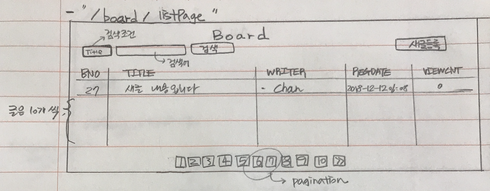
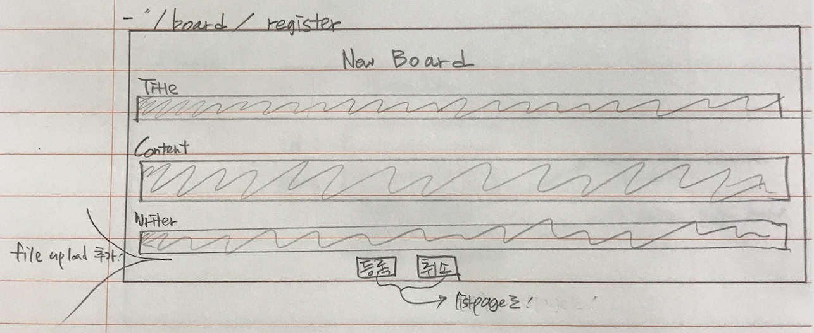
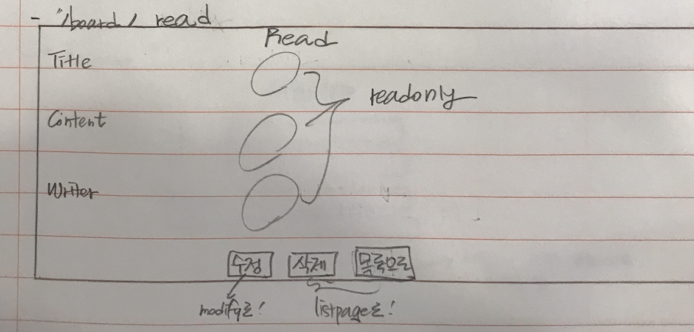
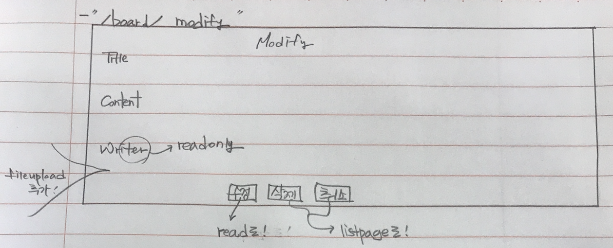
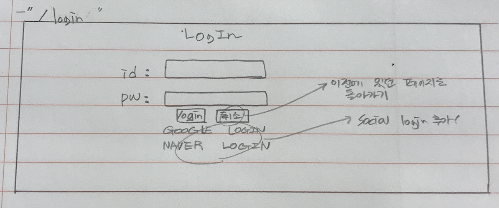
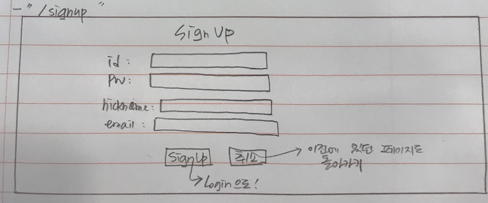

# Chan & Bori's Lifelog

## About

### 프로젝트 명 : Chan And Bori

### 메인 목표 : 보리와 나의 일상을 기록하는 게시판 구현하기

### 개발 환경 :
- OS : MacOS
- Programming Languages : HTML5, CSS, Java, Javascript
- Framework : STS(version3.9.6), Bootstrap(version4.1.3)
- Server(by Google Cloud Platform) : ApacheTomcat(on CentOS), Oracle
- Tools : Github(back-up), SVN(version control), Jenkins(on Ubuntu)

### 세부 구현 내용 :
- 제목, 글 내용, 작성자를 입력하여 게시물 등록
- 게시물 List Page 구현( + pagination )
- 각각의 게시물 조회, 수정, 삭제 구현
- 회원가입 및 로그인 처리 구현( + OAuth2 )
- 사진 파일 업로드 구현

## 웹 페이지 구성

- "/"
-

- "/board/listPage"
- 

- "/board/register"
- 

- "/board/read"
- 

- "/board/modify"
- 

- "/login"
- 

- "/signup"
- 

