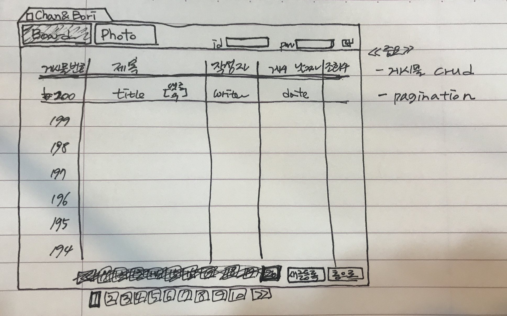
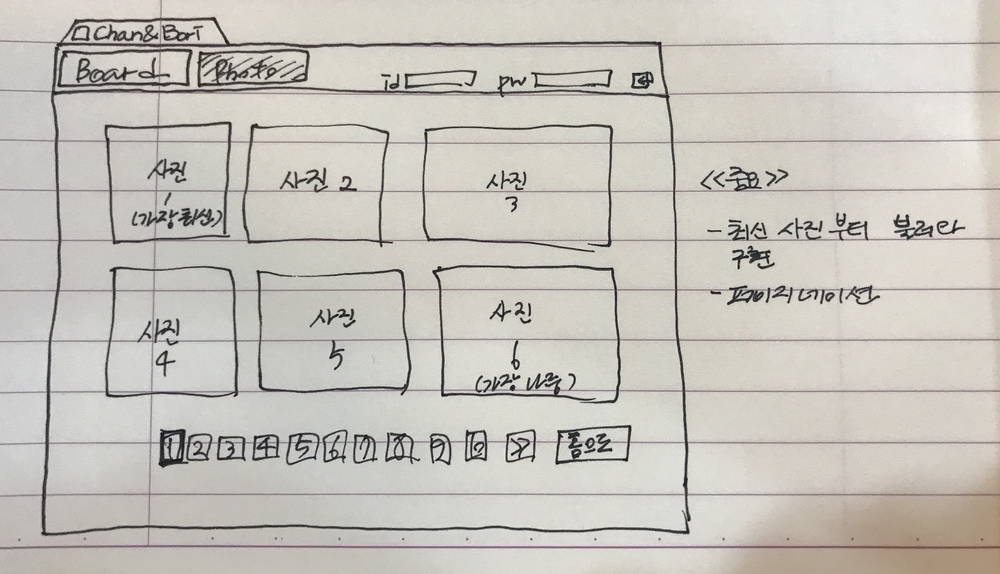

# Chan & Bori's Lifelog

##### 프로젝트 명 : Chan & Bori's Lifelog
##### 메인 목표 : 보리와 나의 일상을 기록할 간단한 게시판 구현
##### 세부 구현 항목
- 제목, 글, 작성자를 입력하여 게시물 등록
- 등록된 게시물에 대한 조회, 수정, 삭제 구현
- 게시물에 대한 댓글 등록 구현 ( Ajax )
- 사진 파일 업로드
- 로그인 처리 구현
- 회원 가입 ( OAuth2 )

##### 개발 환경
- Programming Language : Java, Html, CSS, JQuery
- Framework : SpringToolSuite3(MVC2), Bootstrap
- Server : ApacheTomcat(GCP), MySQL(GCP)
- Deploy : Github, Jenkins(GCP)

##### 웹페이지 구성
- "/"

- "/board"

- "/photo"

